# gobots
The GoBots to Hugging Face's Transformers

##### Table of Contents
- [Architectural Components](#architectural-components)
  - [positional encodings](#positional-encodings)
    - [absolute positional encodings](#absolute-positional-encodings)
    - [Rotary Positional encodings](#rotary-positional-encodings)
    - [T5 relative positional encodings](#t5-relative-positional-encodings)
    - [ALiBi](#alibi)
    - [NoPE](#nope)
  - [Activation functions](#activation-functions)
    - [Sigmoid](#sigmoid)
    - [ReLU](#relu)
    - [Leaky ReLU](#leaky-relu)
    - [ELU](#elu)
    - [GELU](#gelu)
    - [SiLU](#silu)
    - [Swish](#swish)
    - [GLU](#glu)
    - [SwiGLU](#swiglu)
  - [Attention Mechanisms](#attention-mechanisms)
    - [Scaled Dot-Product attention](#scaled-dot-product-attention)
    - [Multi-Head Attention](#multi-head-attention)
    - [Multi-Query Attention](#multi-query-attention)
    - [Grouped-Query Attention](#grouped-query-attention)
    - [Multi-Head Latent Attention](#multi-head-latent-attention)
  - [Feedforward Network](#feedforward-network)
    - [Dense](#dense)
    - [Mixture of Experts](#mixture-of-experts)
- [LLM Architectures](#llm-architectures)
  - [Dense architectures](#dense-architectures)
    - [Llama 3](#llama-3)
    - [Qwen3 dense](#qwen3-dense)
    - [SmolLM33](#smollm3)
  - [Mixture of Experts Architectures](#mixture-of-experts-architectures)
    - [Llama 4](#llama-4)
    - [DeepSeek V3](#deepseek-v3)

## Architectural Components

In what follows, unless otherwise stated, we make make the assumption that inputs to the model take the form `[batchsize, sequence_len, embedding_dimension]`
with generic shape `[n, m, d]`.

### Positional Encodings

much of the insights provided bellow can be found [here](https://arxiv.org/abs/2305.19466).

#### absolute positional encodings

absolute positional encoding add a fixed vector to each element of the input sequence. A popular
version is the sinusoidal encoding (introduced int he original transformer [paper](https://arxiv.org/abs/1706.03762)) which is applied to the inputs before being fed through the transformer blocks

$$
PE_{(pos,i)} = \begin{cases}
                  \sin\left( \frac{m}{10000^{i/d}} \right) & i \text{ is even} \\
                  \cos\left( \frac{m}{10000^{(i - 1)/d}} \right) & i \text{ is odd}
\end{cases}
$$

where $x_m^{(i)}$ is the ith component of the mth input token embedding.

pros:
- easy to implement.
- relatively fast, it is just one addition.

cons:
- does not seem to generalize well to unseen input sequence lengths
- does not encourage attention to any particular positions in the sequence.
- is not explicitly included in the attention mechanism.

#### Rotary Positional encodings

Rotary positional encodings (RoPE), introduced in the RoFormer [paper](https://arxiv.org/abs/2104.09864) work by rotating the query and
key vectors in the attention mechanism by angles proportional to the position in the sequence. The rotation matrix can be parameterized as

$$
\mathbf{R}^d_{\Theta, m} = \begin{pmatrix}
\cos m\theta_1 & -\sin m\theta_1 & 0 & 0 & \dots & 0 & 0 \\
\sin m\theta_1 & \cos m\theta_1 & 0 & 0 & \dots & 0 & 0 \\
0 & 0 &\cos m\theta_2 & -\sin m\theta_2 & \dots & 0 & 0 \\
0 & 0 &\sin m\theta_2 & \cos m\theta_2 & \dots & 0 & 0 \\
\vdots & \vdots & \vdots & \vdots & \ddots & 0 & 0 \\
0 & 0 & 0 & 0 & \dots & \cos m\theta_{d/2} & -\sin m\theta_{d/2} \\
0 & 0 & 0 & 0 & \dots & \sin m\theta_{d/2} & \cos m\theta_{d/2} \\
\end{pmatrix}
$$

where $\theta_i = 10000^{-2(i -1)/d}$ for $i = 1,2,3,\dots,d/2$.t

pros:
- widely adopted
- incorporates positional information directly into the attention mechanism
- does not introduce any parameters into the model
- combines some benefits of relative and absolute encodings

cons:
- more expensive then some encodings (multiplication slower than addition)
- does not scale as well to unseen sequence lengths

#### T5 relative positional encodings

These positional encodings were introduced in the [T5 paper](https://arxiv.org/abs/1910.10683). Here a learned bias is added to the attention scores.
The parameters are shared across layers and attention heads. A fixed number of relative distance buckets are used (32 in the original implementation) up to a maximum distance where the buckets scale logarithmically with distance.

pros:
- incorporated in the attention mechanism
- each attention head gets its own set of embeddings which are shared across layers, making this a fast and parameter efficient encoding mechanism
- generalizes well to unseen sequence lengths
- biases attention has two peaks in relative distance for near and distant tokens.

cons:
- slower then NoPE, ALiBi, and RoPE

#### ALiBi

The term ALiBi comes from the phrase "attention with linear biases" and was introduced [here](https://arxiv.org/pdf/2108.12409). As the name suggests
this method encodes relative positions in the attention mechanism by subtracting a fixed bias term to the attention score which scales linearly with distance.
These biases are not learned and each attention head is given its own bias (shared by all layers).

pros:
- Parameter efficient, no learned parameters
- incorporated into the attention mechanism
- fast to compute

cons:
- biases attention toward nearby tokens.

#### NoPE

As most LLMs are implemented as decoder only transformers explicit positional encoding can be completely forgone. The causal mask in the attention
mechanism appears to be all one needs to include positional information. NoPE, which stands for no positional encoding is precisely this.

pros:
- easy to implement
- adds no overhead
- generalizes to any sequence length

cons:
- Test were performed on a simplified toy model
- may not be better overall in general

### Activation functions

Below are a non-exhaustive list of activation functions. Some, like the sigmoid function, which are not necessarily used in LLMs are include to help explain other activations.

#### Sigmoid

The sigmoid activation function is commonly defined as the logistic function

$$
\sigma(x) = \frac{1}{1 + e^{-x}}
$$

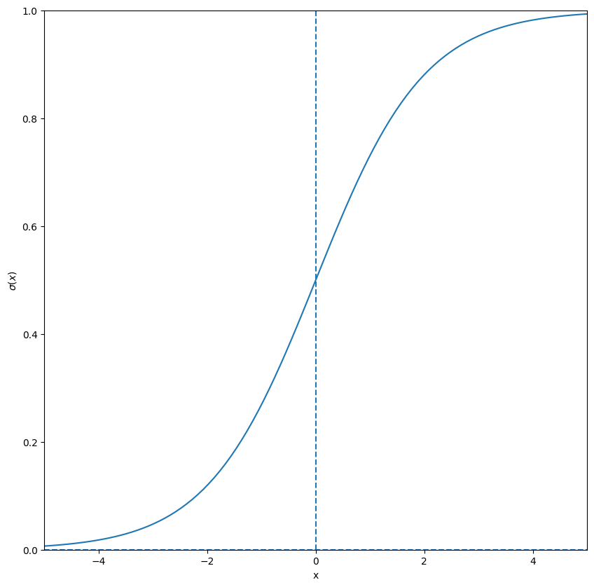

#### ReLU

The rectified linear unit is widely popular in many architectures. It can lead to a problem of negative values being set to zero and thus passing forward little to no information.

$$
\mathrm{ReLU}(x) = \begin{cases}
x & x > 0 \\
0 & x \leq 0
\end{cases}
$$

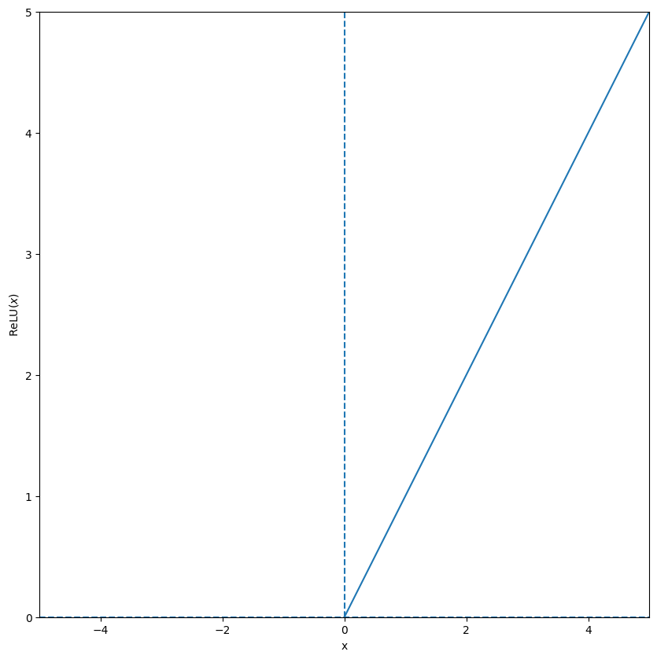

#### Leaky ReLU

The leaky ReLU activation attempts to fix the dying ReLU problem by allowing small negative values

$$
\mathrm{LReLU}_\alpha(x) = \begin{cases}
x & x > 0 \\
\alpha * x & x \leq 0
\end{cases}
$$

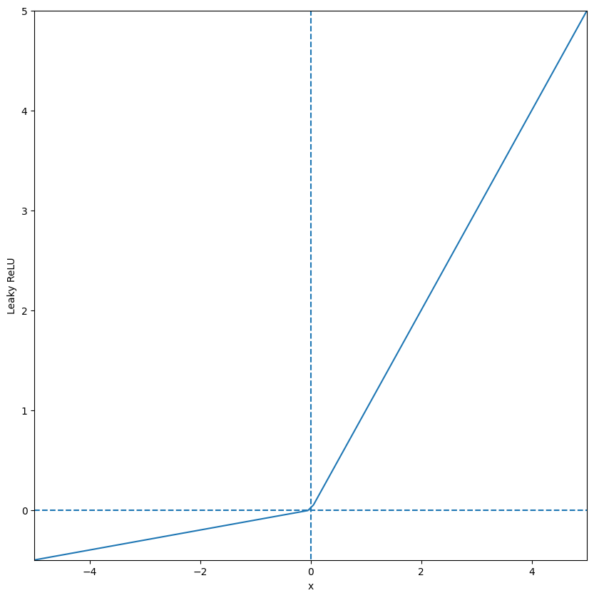

#### ELU

Another attempt to solve the issues of ReLU is the exponential linear unit (ELU).

$$
\mathrm{LReLU}_\alpha(x) = \begin{cases}
x & x > 0 \\
\alpha \left( e^x - 1 \right) & x \leq 0
\end{cases}
$$

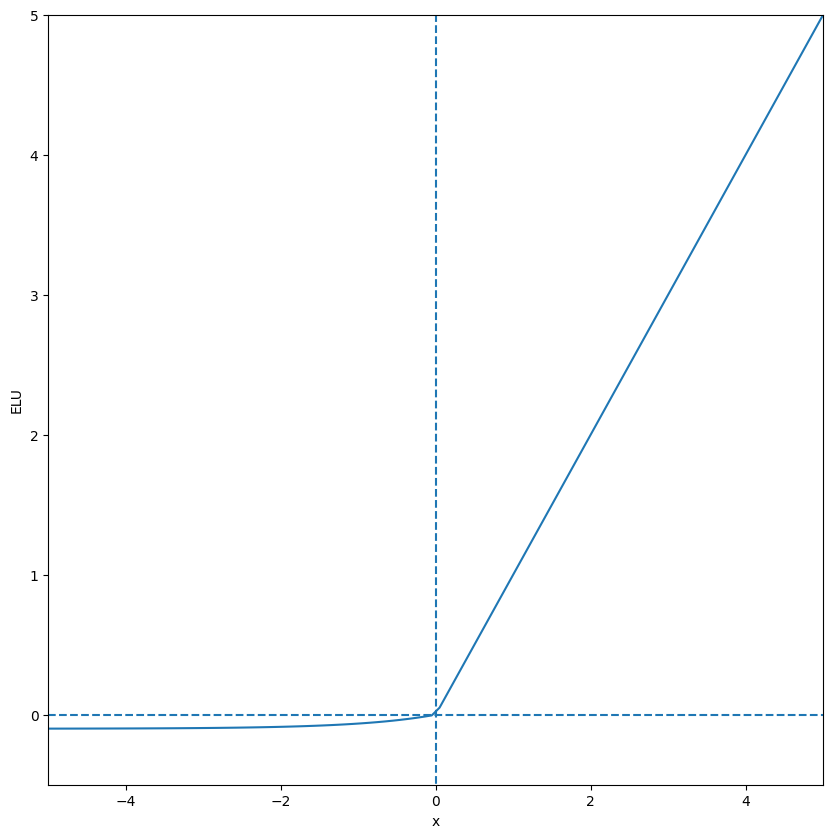

#### GELU

The Gaussian error linear unit which is approximated as

$$
\mathrm{GELU}(x) = 0.5 x \left[1 + \tanh\right( \sqrt{2 / \pi} (x + 0.044715 x^3)\left) \right]
$$

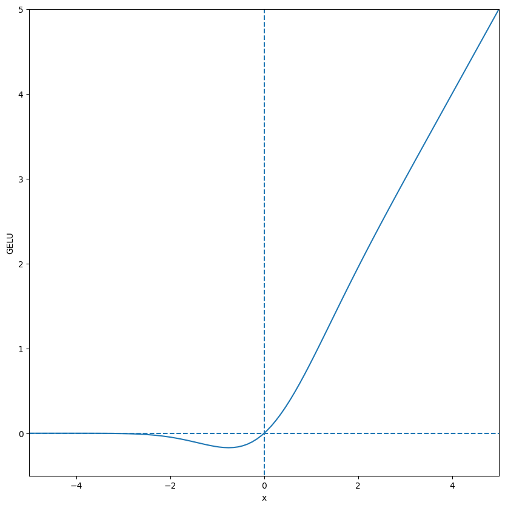

#### SiLU

The sigmoid linear unit

$$
\mathrm{SiLU}(x) = x \sigma(x)
$$

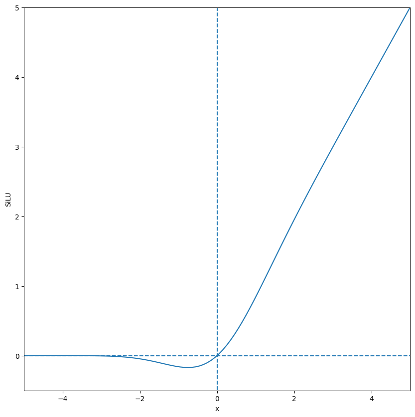

#### Swish

The Swish activation is an extension to SiLU that adds a weighting to the sigmoid component

$$
\mathrm{swish}_{\beta}(x) = x \sigma(\beta x)
$$

#### GLU

The Gated linear unit is an adaptation of the idea of the gate units from RNNs where the network learns what information to pass on

$$
\mathrm{GLU}(x) = (x W + b) \otimes \sigma(x V + c)
$$

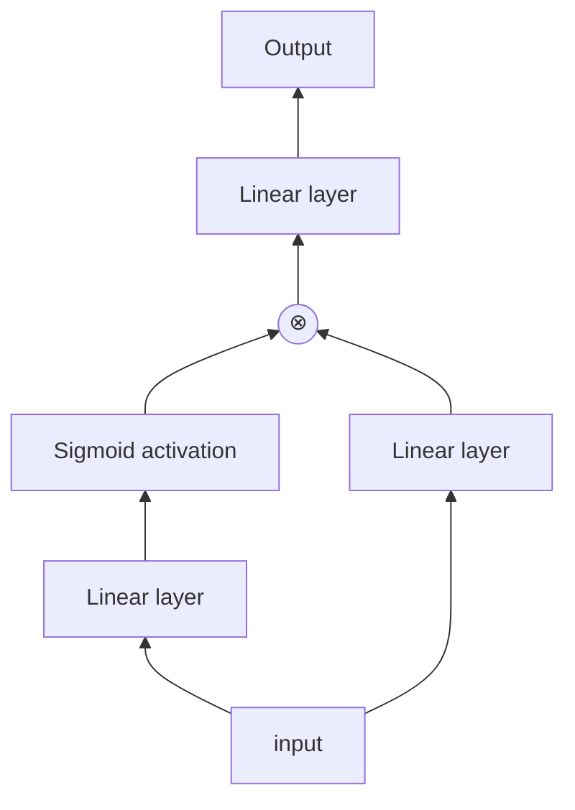

parameterized by the weights $W$ and $V$ and the biases $b$ and $c$.

#### SwiGLU

SwiGLU is a combination of the swish and GLU activations where the sigmoid of GLU is replaced with swish

$$
\mathrm{SwiGLU}(x) = \mathrm{swish}(x W + b) \otimes (x V + c)
$$

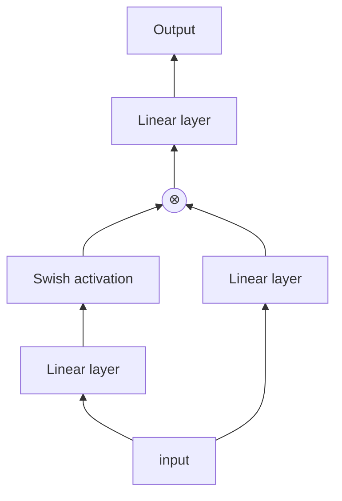
### Attention Mechanisms

The heart of any transformer model is the attention mechanism. In general an attention block takes three inputs, a query $Q$, a key $K$, and a value $V$.
In the case of a decoder-only model the query, key, and value are all the same sequence of vectors.

#### Scaled Dot-Product attention

Scaled-dot product attention can be thought of as a mechanism where the query and key attend to each other via the dot product. The attention score is calculated as softmax of the dot-product between
the query and key. A mask, $M$ is applied to hide certain tokens from eachother. This can be done to remove padding tokens or to make the model causal by only allowing tokens to attend to previous elements of the sequence.
The attention score is then used to weight the value for the output.

$$
\mathrm{Attention}(Q,K,V) = \mathrm{softmax}\left( \frac{QK^T}{\sqrt{d^k}} \odot M \right)V
$$

#### Multi-Head Attention

Multi-head attention (MHA) generalizes standard dot-product attention by combining several attenion calculations at every step.

$$
\mathrm{Multihead}(Q,K,V) = \mathrm{concat}_{i=1,\dots,h} \left[ \mathrm{Attention}\left(Q W^Q_i, K W^K_i, V W^V_i \right) \right] W^o
$$

for some weight matrices $W_i^Q \in \mathbb{R}^{d \times d_q}$, $W_i^K \in \mathbb{R}^{d \times d_k}$, $W_i^V \in \mathbb{R}^{d \times d_v}$ and $W^o \in \mathbb{R}^{h \cdot d_v \times d}$.

#### Multi-Query Attention

Multi-Query attention (MQA) is similar to multi-head attention where there are multiple query heads and a single key and value head that are shared byt all query heads. This reduces the complexity of the model at the expense of performance.

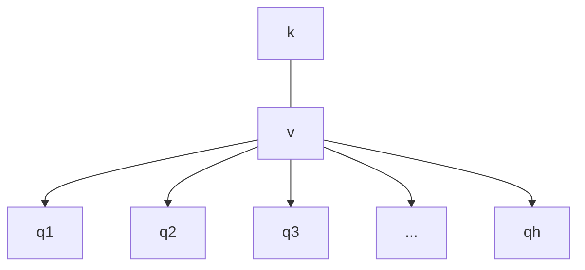

#### Grouped-Query Attention

Grouped-query attention (GQA) can be seen as a trade-off beteen the accuracy of full multi-head attention and the efficiency of mult-query attention. In GQA there are $h_{kv}$ attention heads for the key and value space which are shared by the $h$ query heads
where $h_{kv} < h$ and $h \mod h_{kv} = 0$. An additional benefit of this method is that, unlike MQA, one can train a model using full MHA attention and perform "up-training" to convert a model to use GQA.

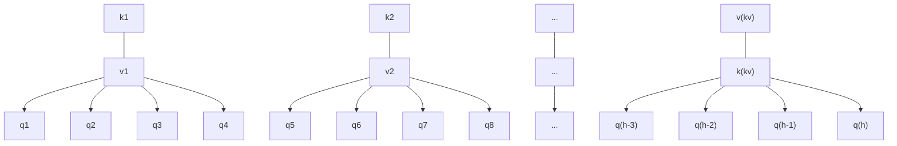

#### Multi-Head Latent Attention

In multi-head latent attention (MLA) the querys, keys, and values are all compressed into lower rank spaces before applying the attention operation. The primary purpose of this operation is to lower the size of the KV cache
at inference time. In order to incorporate positional embeddings while preserving the benefits of the low-rank projection the DeepSeek architects created a decoupled RoPE mechanism. Here we concatenate two vectors, one which carries
the content information and another which bears the RoPE positional information

$$
c_t^{KV} = W^{DKV} h_t,
$$

$$
[k^C_{t,1}; k^C_{t,2}; \dots, k^C_{t,n_h}] = k^C_t = W^{UK} c^{KV}_t,
$$

$$
k^R_t = \mathrm{RoPE}(W^{KR} h_t),
$$

$$
k_{t,i} = [k^C_{t,i}; k^R_t]
$$

$$
[v^C_{t,1}; v^C_{t,2}; \dots, v^C_{t,n_h}] = v^C_t = W^{UV} c^{KV}_t,
$$

$$
c_t^{Q} = W^{DQ} h_t,
$$

$$
[q^C_{t,1}; q^C_{t,2}; \dots, q^C_{t,n_h}] = q^C_t = W^{UQ} c^{Q}_t,
$$

$$
[q^R_{t,1}; q^R_{t,2}; \dots, q^R_{t,n_h}] = q^R_t = \mathrm{RoPE}(W^{QR} c^Q_t),
$$

$$
q_{t,i} = [q^C_{t,i}; q^R_{t,i}]
$$

We then apply attention between the query, key and value represented by $q_{t,i}$, $k_{t,i}$, and $v_{t,i}$ respectively. Where $n_h$ is the number of attention heads, $d_h$ the dimension of each head,
the compression dimensions $d_c (\ll d_h n_h)$ and $d_c^\prime (\ll d_h n_h)$. The projections are $W^{DKV} \in \mathbb{R}^{d_c \times d}$, $W^{UK}, W^{UV} \in \mathbb{R}^{d_h n_h \times d_c}$,
$W^{KR} \in \mathbb{R}^{d^R_h \times d}$, $W^{DQ} \in \mathbb{R}^{d^\prime_c \times d}$, $W^{UQ} \in \mathbb{R}^{d_h n_h \times d^\prime_c}$, $W^QR \ in \mathbb{R}^{d^R_h n_h \times d^\prime_c}$.

### Feedforward Network

The second common component of all transformer architectures is the feedforward layer. The feedforward layer is applied after the attention mechanism as a way to add extra information to the token embeddings and to prepare the
output of the attention block for the next transformer block layer in the stack.

#### dense

A dense feedforward layer is simply a dense neural network layer that is applied to all outputs of the attention mechanism. The layer is shared across the sequence. In many new LLMs the feedforward layer is a SwiGLU layer.

#### Mixture of Experts

A mixture of experts (MoE) layer consists of two sets of parallel dense feedforward layers, known as experts. One set, the shared experts, are applied to all tokens containing $N_s$ experts. For the other set, the routed experts, $K_r$ experts are choosen per token from the $N_r$ available experts. A routing model is used to
create a gate which decides which experts will be activated for a given token.

Several versions of MoE have been proposed, below we follow the one used in [DeepSeek V3](https://arxiv.org/abs/2412.19437) when calculating the gating function

$$
\mathrm{MoE}(u_t) = u_t + \sum\limits_{i=1}^{N_s} \mathrm{FFN}_i^{(s)}(u_t) + \sum\limits_{i=1}^{N_r} g_{i, t}\mathrm{FFN}_i^{(r)}(u_t)
$$

$$
g_{i,t} = \frac{g^{\prime}_{i,t}}{\sum\limits_{j=1}^{N_r} g^{\prime}_{j,t}}
$$

$$
g^{\prime}_{i,t} = \begin{cases}
s_{i,t} & s_{i,t} \in \mathrm{TopK}(\{s_{i,t} \mid 1 \leq j \leq N_r \}) \\
0 & \mathrm{else}
\end{cases}
$$

$$
s_{i,t} = \sigma(u^T_t e_i)
$$

where $e_i$ are the weights of the routing model.

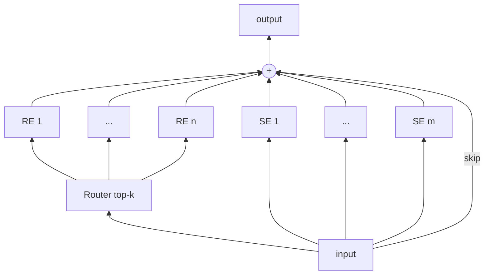

A problem that might arise when training an MoE layer is that the model may learn to use one or a few of the experts exclusively. A popular solution to this problem is to add an auxiliary loss which enforces load balancing amongst experts ($T$ being the sequence length)

$$
\mathcal{L}_\mathrm{balance} = \alpha \sum\limits^{N_r}_{i = 1} f_i P_i
$$

$$
f_i = \frac{N_r}{K_r T} \sum\limits^T_{t=1} \mathbf{id}(\mbox{token } t \mbox{ selects expert } i)
$$

$$
P_i = \frac{1}{T} \sum\limits^T_{t=1} s_{i,t}.
$$

Adding this loss may hamper model accuracy, an alternative that provides load balancing without an auxiliary loss can be found [here](https://arxiv.org/abs/2408.15664)). In this implementaton
a bias is added when finding the top-k experts.

$$
g^{\prime}_{i,t} = \begin{cases}
s_{i,t} & s_{i,t} + b_i\in \mathrm{TopK}(\{s_{i,t} + b_i \mid 1 \leq j \leq N_r \}) \\
0 & \mathrm{else}
\end{cases}
$$

At training time the biases are initialized to zero and updated by adding or subtracting a small value depending on whether the given expert is over or under loaded.

## LLM Architectures

Models in this collection share some common parameters:

- `attention_bias`(`bool` *optional* defaults to `False`): whether to include a bias term in the attention blocks.
- `attention_dropout` (`float` *optional* defaults to `0.0`): dropout rate in the attention blocks.
- `hidden_dim` (`int`, *optional* default to `2048`): the embedding dimension for tokens.
- `intermediate_dim` (`int` *optional* defaults to `8192`): dimension of the feedforward layers.
- `max_position_embeddings` (`int` *optional* defaults to `4096`): maximum number of positional embeddings supported.
-  `mlp_bias` (`bool` *optional* defaults to `False`): whether to include bias in the feedforward networks.
- `num_attention_heads` (`int` *optional* defaults to `32`): number of attention heads per query.
- `num_hidden_layers` (`int` *optional* ddefaults to `16`): number of attention blocks.
- `num_key_value_heads` (`int` *optional* defaults to `8`): number of key/value heads in the attention mechanism if num_key_value_heads < num_attention_heads uses grouped query attention. If ``num_key_value_heads = 1` this becomes MQA, for `num_key_value_heads = num_attention_heads` it is full MHA, and for any other value `0 < num_key_value_heads < num_attention_heads` it leads to GQA.
- `rope_base` (`float` *optional* defaults to `500000.0`): the base for the RoPE embedding.
- `rms_norm_eps` (`float` *optional* defaults to `1E-05`): regularizer for rms norm layers 
- `vocab_size` (`int`, *optional*, defaults to 32000): vocabulary size for the model.

### Dense Architectures

#### Llama 3

LLama 3 has a fairly straightforward architecture. Its stand out features are the use of GQA, SwiGLU feedforward layers, and RoPE encodings.

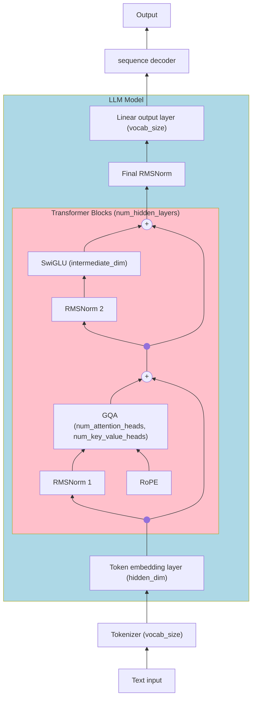
As an example a model with the architecture of Llama 3.2 1B can be created with the following configuration

```python
from gobots.models.llama3_clone import Llama3Config, Llama3Model


config = Llama3Config(
    vocab_size=128256,
    hidden_dim=2048,
    intermediate_dim=8192,
    num_attention_heads=32,
    num_hidden_layers=16,
    num_key_value_heads=8,
    attention_bias=False,
    attention_dropout=0.0,
    mlp_bias=False,
    rms_norm_eps=1e-05,
    max_position_embeddings=131072,
    rope_base=500000.0,
)
model = Llama3Model(config)
```

#### Qwen3 dense

Qwen3 has a similar architecture to LLama 3 with GQA, SwiGLU feedforard layers, and RoPE encodings. The primary distinguishing feature is the inclusion
of RMS norm layers applied to the query and key after the attention head projections but before the dot product.

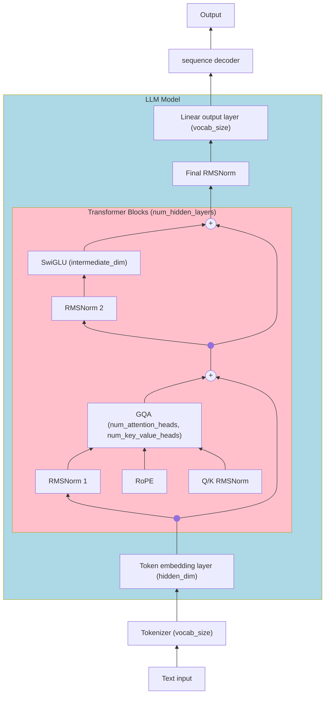
As an example a model with the architecture of Qwen3 4B can be created with the following configuration

```python
from gobots.models.qwen3_dense_clone import Qwen3DenseConfig, Qwen3DenseModel


config = Qwen3DenseConfig(
    vocab_size=151936,
    hidden_dim=2560,
    intermediate_dim=9728,
    num_attention_heads=32,
    num_hidden_layers=36,
    num_key_value_heads=8,
    attention_bias=False,
    attention_dropout=0.0,
    mlp_bias=False,
    rms_norm_eps=1e-06,
    max_position_embeddings=40960,
    rope_base=1000000,
)
model = Qwen3DenseModel(config)
```

#### SmolLM3

Similar to Llama 3 this model uses GQA and SwiGLU feedforward layers. The primary distinguishing feature is that it uses a mixture of RoPE and NoPE positional
encodings. Most layers use RoPE however, every `no_rope_layer_interval` layers the RoPE encoding is replaced with NoPE. The thought behind this choice is to
capture both the positional information of RoPE with the long context length of NoPE.

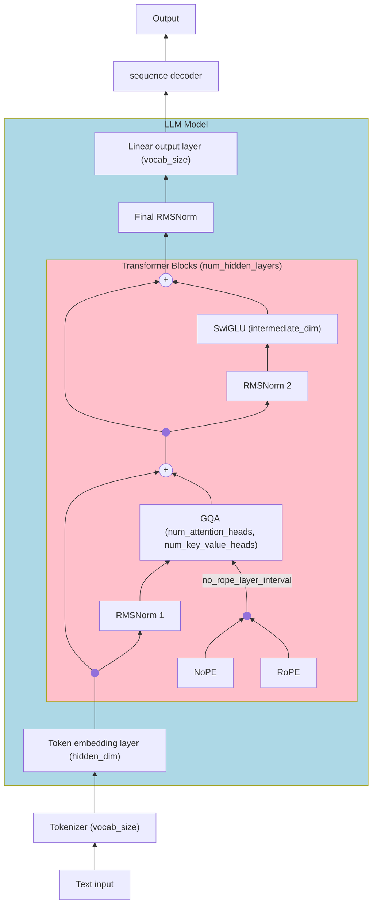

As an example a model with the architecture of SmolLM3 3B can be created with the following configuration

```python
from gobots.models.smollm3_clone import SmolLM3Config, SmolLM3Model


config = SmolLM3Config(
    vocab_size=128256,
    hidden_dim=2048,
    intermediate_dim=11008,
    num_attention_heads=16,
    num_hidden_layers=36,
    num_key_value_heads=4,
    attention_bias=False,
    attention_dropout=0.0,
    mlp_bias=False,
    rms_norm_eps=1e-06,
    no_rope_layer_interval=4,
    max_position_embeddings=65536,
    rope_base=5000000.0,
)
model = SmolLM3Model(config)
```

### Mixture of Experts Architectures

#### Llama 4

Llama 4 uses GQA and SwiGLU Feedforward layers. Every other layer uses an MoE layer as opposed to a dense layer. Each MoE has a single shared expert and uses one routed expert per token.

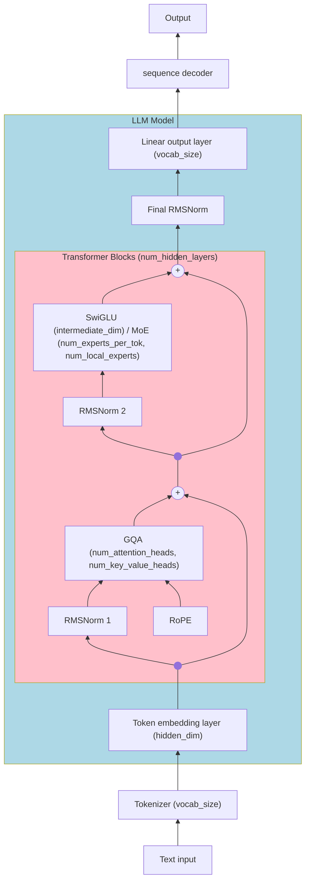

As an example a model with the architecture of Llama 4 17B with 16 experts per MoE layer:

```python
from gobots.models.llama4_clone import Llama4Config, Llama4Model


config = Llama4Config(
    vocab_size=202048,
    hidden_dim=5120,
    interleave_moe_layer_step=1,
    intermediate_dim=8192,
    intermediate_size_mlp=16384,
    num_experts_per_tok=1,
    num_local_experts=16,
    num_attention_heads=40,
    num_hidden_layers=48,
    num_key_value_heads=8,
    attention_bias=False,
    attention_dropout=0.0,
    mlp_bias=False,
    use_qk_norm=True,
    rms_norm_eps=1e-05,
    max_position_embeddings=262144,
    rope_base=500000.0,
    )
model = Llama4Model(config)
```

#### DeepSeek V3

Another popular model which employs MoE feedforward layers is DeepSeek V3. The primary differences between this model and Llama 4 are the use of MLA instead of GQA, selects more than one routed expert per layer,and begins with `first_k_dense_replace` dense layers. Additionally this model adds $n_\mathrm{MTP}$ multi-token prediction heads to predict the next $1 + n_\mathrm{MTP}$
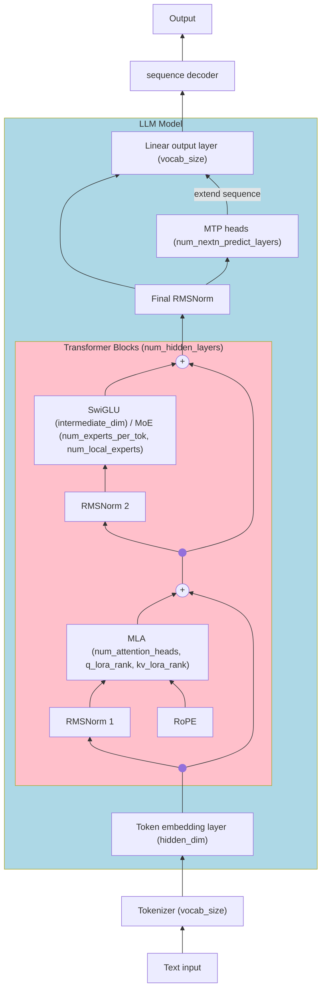

```python
from gobots.models.deepseek_v3_clone import DeepSeekV3Config, DeepSeekV3Model

config = DeepSeekV3Config(
    vocab_size=129280,
    pad_token_id=2,
    hidden_dim=7168,
    intermediate_dim=18432,
    moe_intermediate_size=2048,
    num_experts_per_tok=8,
    n_routed_experts=256,
    num_attention_heads=128,
    num_hidden_layers=61,
    attention_bias=False,
    attention_dropout=0.0,
    mlp_bias=False,
    rms_norm_eps=1e-06,
    max_position_embeddings=163840,
    rope_base=10000.0,
    n_shared_experts=1,
    first_k_dense_replace=3,
    kv_lora_rank=512,
    q_lora_rank=1536,
    qk_nope_head_dim=128,
    qk_rope_head_dim=64,
    v_head_dim=128,
    num_nextn_predict_layers=1,
    initializer_range=0.02,
    mtp_config={
        "attention_type": "multi_head_latent_attention",
        "d_model": 7168,
        "num_heads": 128,
        "v_head_dim": 128,
        "q_lora_rank": 1536,
        "kv_lora_rank": 512,
        "qk_rope_head_dim": 128,
        "qk_nope_head_dim": 64, 
        "dropout": 0.0,
        "attention_bias": False,
        "feedforward_type": "moe",
        "n_shared_experts": 1,
        "n_routed_experts": 256,
        "intermediate_size": 2048,
        "num_experts_per_token": 1,
    },  
)
model = DeepSeekV3Model(config)
```
