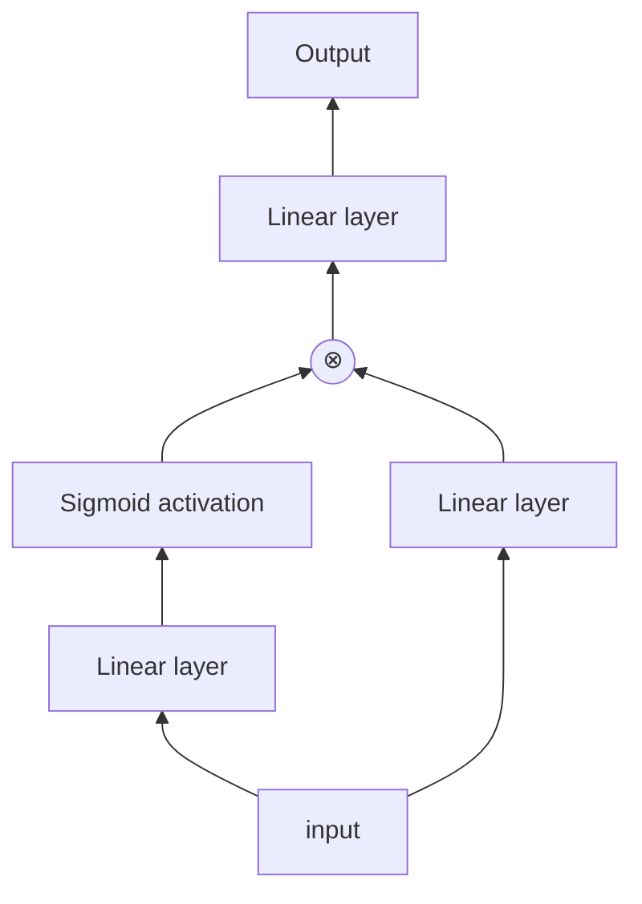
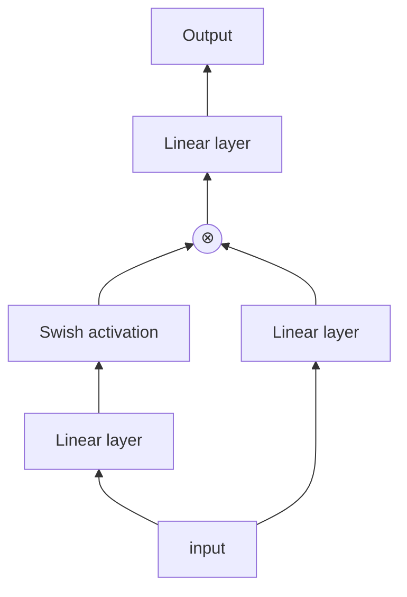
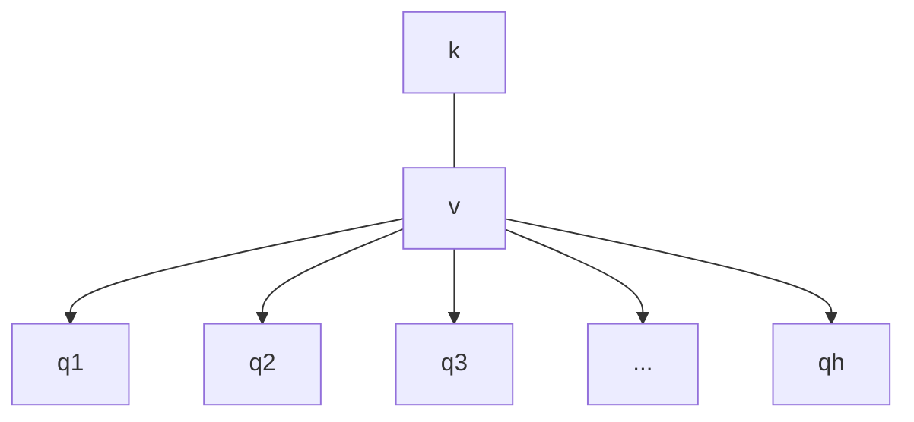
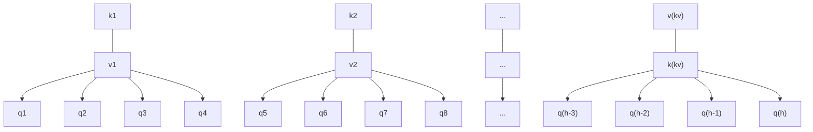
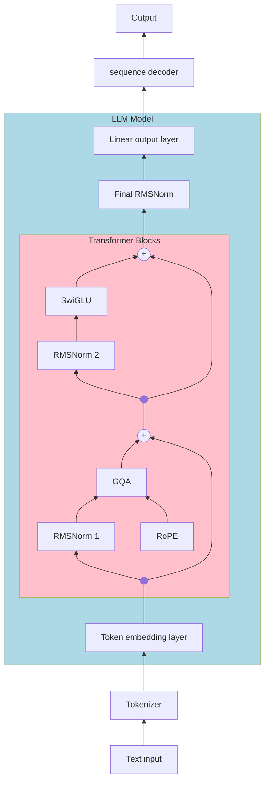
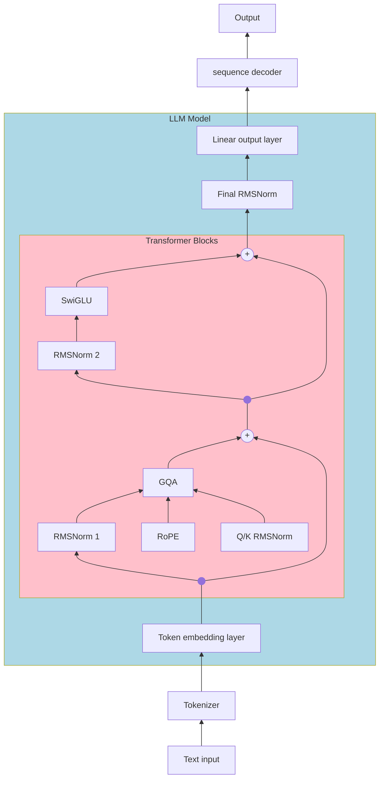
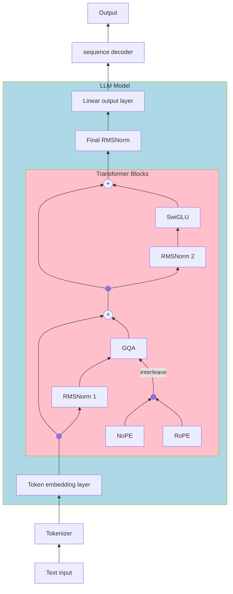

# gobots
The GoBots to Hugging Face's Transformers

##### Table of Contents
- [Architectural Components](#architectural-components)
  - [positional encodings](#positional-encodings)
    - [absolute positional encodings](#absolute-positional-encodings)
    - [Rotary Positional encodings](#rotary-positional-encodings)
    - [T5 relative positional encodings](#t5-relative-positional-encodings)
    - [ALiBi](#alibi)
    - [NoPE](#nope)
  - [Activation functions](#activation-functions)
    - [Sigmoid](#sigmoid)
    - [ReLU](#relu)
    - [Leaky ReLU](#leaky-relu)
    - [ELU](#elu)
    - [GELU](#gelu)
    - [SiLU](#silu)
    - [Swish](#swish)
    - [GLU](#glu)
    - [SwiGLU](#swiglu)
  - [Attention Mechanisms](#attention-mechanisms)
    - [Scaled Dot-Product attention](#scaled-dot-product-attention)
    - [Multi-Head Attention](#multi-head-attention)
    - [Multi-Query Attention](#multi-query-attention)
    - [Grouped-Query Attention](#grouped-query-attention)
  - [Feedforward Network](#feedforward-network)
    - [Dense](#dense)
    - [Mixture of Experts](#mixture-of-experts)
- [LLM Architectures](#llm-architectures)
  - [Dense architectures](#dense-architectures)
    - [Llama 3](#llama-3)
    - [Qwen3 dense](#qwen3-dense)
    - [SmolLM33](#smollm3)
  - [Mixture of Experts Architectures](#mixture-of-experts-architectures)

## Architectural Components

In what follows, unless otherwise stated, we make make the assumption that inputs to the model take the form `[batchsize, sequence_len, embedding_dimension]`
with generic shape `[n, m, d]`.

### Positional Encodings

much of the insights provided bellow can be found [here](https://arxiv.org/abs/2305.19466).

#### absolute positional encodings

absolute positional encoding add a fixed vector to each element of the input sequence. A popular
version is the sinusoidal encoding (introduced int he original transformer [paper](https://arxiv.org/abs/1706.03762)) which is applied to the inputs before being fed through the transformer blocks

$$
PE_{(pos,i)} = \begin{cases}
                  \sin\left( \frac{m}{10000^{i/d}} \right) & i \text{ is even} \\
                  \cos\left( \frac{m}{10000^{(i - 1)/d}} \right) & i \text{ is odd}
\end{cases}
$$

where $x_m^{(i)}$ is the ith component of the mth input token embedding.

pros:
- easy to implement.
- relatively fast, it is just one addition.

cons:
- does not seem to generalize well to unseen input sequence lengths
- does not encourage attention to any particular positions in the sequence.
- is not explicitly included in the attention mechanism.

#### Rotary Positional encodings

Rotary positional encodings (RoPE), introduced in the RoFormer [paper](https://arxiv.org/abs/2104.09864) work by rotating the query and
key vectors in the attention mechanism by angles proportional to the position in the sequence. The rotation matrix can be parameterized as

$$
\mathbf{R}^d_{\Theta, m} = \begin{pmatrix}
\cos m\theta_1 & -\sin m\theta_1 & 0 & 0 & \dots & 0 & 0 \\
\sin m\theta_1 & \cos m\theta_1 & 0 & 0 & \dots & 0 & 0 \\
0 & 0 &\cos m\theta_2 & -\sin m\theta_2 & \dots & 0 & 0 \\
0 & 0 &\sin m\theta_2 & \cos m\theta_2 & \dots & 0 & 0 \\
\vdots & \vdots & \vdots & \vdots & \ddots & 0 & 0 \\
0 & 0 & 0 & 0 & \dots & \cos m\theta_{d/2} & -\sin m\theta_{d/2} \\
0 & 0 & 0 & 0 & \dots & \sin m\theta_{d/2} & \cos m\theta_{d/2} \\
\end{pmatrix}
$$

where $\theta_i = 10000^{-2(i -1)/d}$ for $i = 1,2,3,\dots,d/2$.t

pros:
- widely adopted
- incorporates positional information directly into the attention mechanism
- does not introduce any parameters into the model
- combines some benefits of relative and absolute encodings

cons:
- more expensive then some encodings (multiplication slower than addition)
- does not scale as well to unseen sequence lengths

#### T5 relative positional encodings

These positional encodings were introduced in the [T5 paper](https://arxiv.org/abs/1910.10683). Here a learned bias is added to the attention scores.
The parameters are shared across layers and attention heads. A fixed number of relative distance buckets are used (32 in the original implementation) up to a maximum distance where the buckets scale logarithmically with distance.

pros:
- incorporated in the attention mechanism
- each attention head gets its own set of embeddings which are shared across layers, making this a fast and parameter efficient encoding mechanism
- generalizes well to unseen sequence lengths
- biases attention has two peaks in relative distance for near and distant tokens.

cons:
- slower then NoPE, ALiBi, and RoPE

#### ALiBi

The term ALiBi comes from the phrase "attention with linear biases" and was introduced [here](https://arxiv.org/pdf/2108.12409). As the name suggests
this method encodes relative positions in the attention mechanism by subtracting a fixed bias term to the attention score which scales linearly with distance.
These biases are not learned and each attention head is given its own bias (shared by all layers).

pros:
- Parameter efficient, no learned parameters
- incorporated into the attention mechanism
- fast to compute

cons:
- biases attention toward nearby tokens.

#### NoPE

As most LLMs are implemented as decoder only transformers explicit positional encoding can be completely forgone. The causal mask in the attention
mechanism appears to be all one needs to include positional information. NoPE, which stands for no positional encoding is precisely this.

pros:
- easy to implement
- adds no overhead
- generalizes to any sequence length

cons:
- Test were performed on a simplified toy model
- may not be better overall in general

### Activation functions

Below are a non-exhaustive list of activation functions. Some, like the sigmoid function, which are not necessarily used in LLMs are include to help explain other activations.

#### Sigmoid

The sigmoid activation function is commonly defined as the logistic function

$$
\sigma(x) = \frac{1}{1 + e^{-x}}
$$

#### ReLU

The rectified linear unit is widely popular in many architectures. It can lead to a problem of negative values being set to zero and thus passing forward little to no information.

$$
\mathrm{ReLU}(x) = \begin{cases}
x & x > 0 \\
0 & x \leq 0
\end{cases}
$$

#### Leaky ReLU

The leaky ReLU activation attempts to fix the dying ReLU problem by allowing small negative values

$$
\mathrm{LReLU}_\alpha(x) = \begin{cases}
x & x > 0 \\
\alpha * x & x \leq 0
\end{cases}
$$

#### ELU

Another attempt to solve the issues of ReLU is the exponential linear unit (ELU).

$$
\mathrm{LReLU}_\alpha(x) = \begin{cases}
x & x > 0 \\
\alpha \left( e^x - 1 \right) & x \leq 0
\end{cases}
$$

#### GELU

The Gaussian error linear unit which is approximated as

$$
\mathrm{GELU}(x) = 0.5 x \left[1 + \tanh\right( \sqrt{2 / \pi} (x + 0.044715 x^3)\left) \right]
$$

#### SiLU

The sigmoid linear unit

$$
\mathrm{SiLU}(x) = x \sigma(x)
$$

#### Swish

The Swish activation is an extension to SiLU that adds a weighting to the sigmoid component

$$
\mathrm{swish}_{\beta}(x) = x \sigma(\beta x)
$$

#### GLU

The Gated linear unit is an adaptation of the idea of the gate units from RNNs where the network learns what information to pass on

$$
\mathrm{GLU}(x) = (x W + b) \otimes \sigma(x V + c)
$$

parameterized by the weights $W$ and $V$ and the biases $b$ and $c$.

#### SwiGLU

SwiGLU is a combination of the swish and GLU activations where the sigmoid of GLU is replaced with swish

$$
\mathrm{SwiGLU}(x) = \mathrm{swish}(x W + b) \otimes (x V + c)
$$

### Attention Mechanisms

The heart of any transformer model is the attention mechanism. In general an attention block takes three inputs, a query $Q$, a key $K$, and a value $V$.
In the case of a decoder-only model the query, key, and value are all the same sequence of vectors.

#### Scaled Dot-Product attention

Scaled-dot product attention can be thought of as a mechanism where the query and key attend to each other via the dot product. The attention score is calculated as softmax of the dot-product between
the query and key. A mask, $M$ is applied to hide certain tokens from eachother. This can be done to remove padding tokens or to make the model causal by only allowing tokens to attend to previous elements of the sequence.
The attention score is then used to weight the value for the output.

$$
\mathrm{Attention}(Q,K,V) = \mathrm{softmax}\left( \frac{QK^T}{\sqrt{d^k}} \odot M \right)V
$$

#### Multi-Head Attention

Multi-head attention (MHA) generalizes standard dot-product attention by combining several attenion calculations at every step.

$$
\mathrm{Multihead}(Q,K,V) = \mathrm{concat}_{i=1,\dots,h} \left[ \mathrm{Attention}\left(Q W^Q_i, K W^K_i, V W^V_i \right) \right] W^o
$$

for some weight matrices $W_i^Q \in \mathbb{R}^{d \times d_q}$, $W_i^K \in \mathbb{R}^{d \times d_k}$, $W_i^V \in \mathbb{R}^{d \times d_v}$ and $W^o \in \mathbb{R}^{h \cdot d_v \times d}$.

#### Multi-Query Attention

Multi-Query attention (MQA) is similar to multi-head attention where there are multiple query heads and a single key and value head that are shared byt all query heads. This reduces the complexity of the model at the expense of performance.

#### Grouped-Query Attention

Grouped-query attention (GQA) can be seen as a trade-off beteen the accuracy of full multi-head attention and the efficiency of mult-query attention. In GQA there are $h_{kv}$ attention heads for the key and value space which are shared by the $h$ query heads
where $h_{kv} < h$ and $h \mod h_{kv} = 0$. An additional benefit of this method is that, unlike MQA, one can train a model using full MHA attention and perform "up-training" to convert a model to use GQA.

### Feedforward Network

The second common component of all transformer architectures is the feedforward layer. The feedforward layer is applied after the attention mechanism as a way to add extra information to the token embeddings and to prepare the output of the attention block
for the next transformer block layer in the stack.

#### dense

A dense feedforward layer is simply a dense neural network layer that is applied to all outputs of the attention mechanism. The layer is shared across the sequence. In many new LLMs the feedforward layer is a SwiGLU layer.

#### Mixture of Experts

*FILL IN LATER*

## LLM Architectures

### Dense Architectures

#### Llama 3

#### Qwen3 dense

#### SmolLM3

### Mixture of Experts Architectures

*FILL IN LATER*
